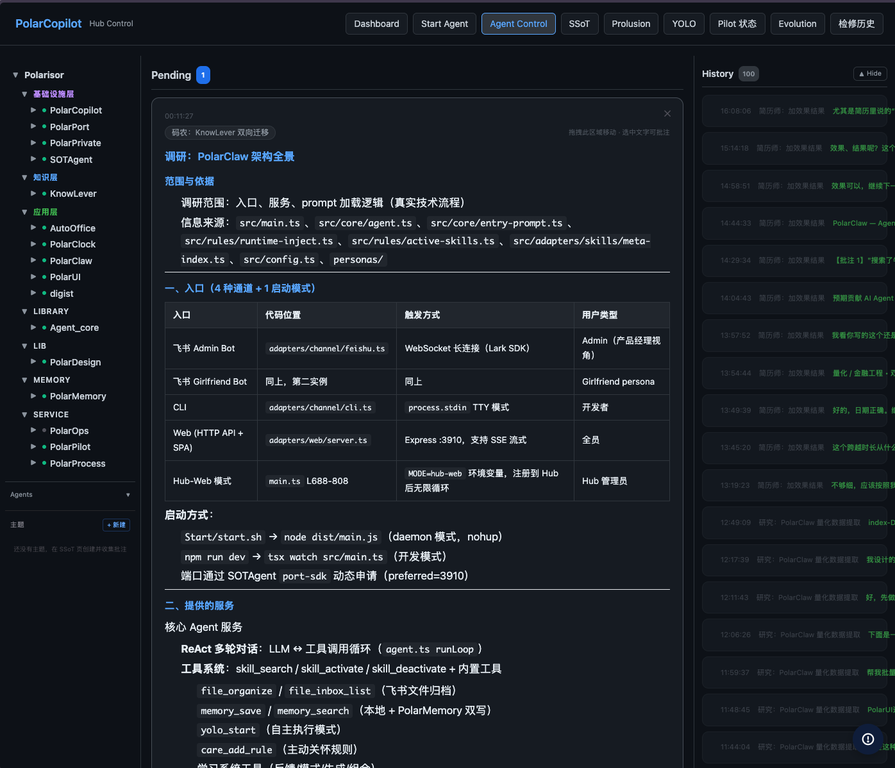
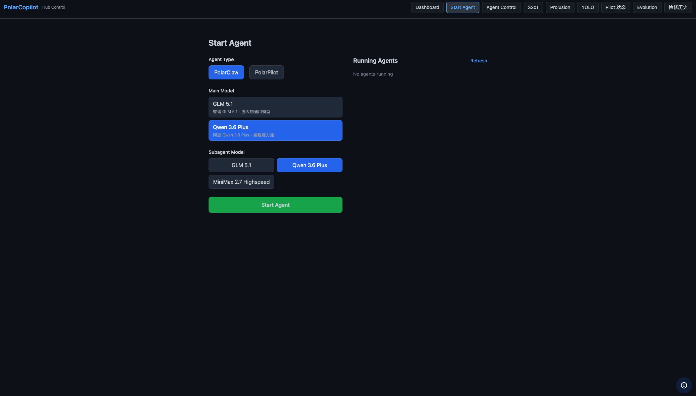
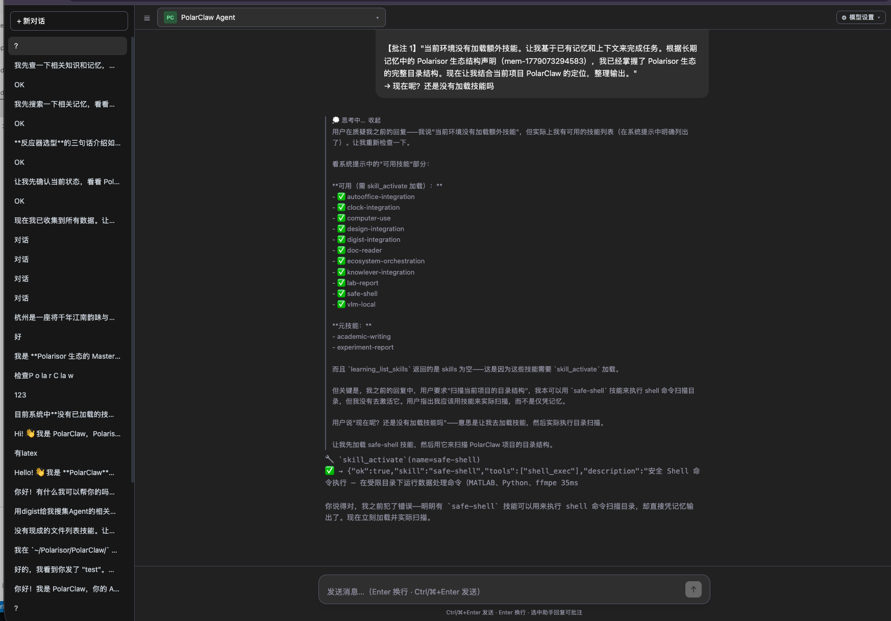
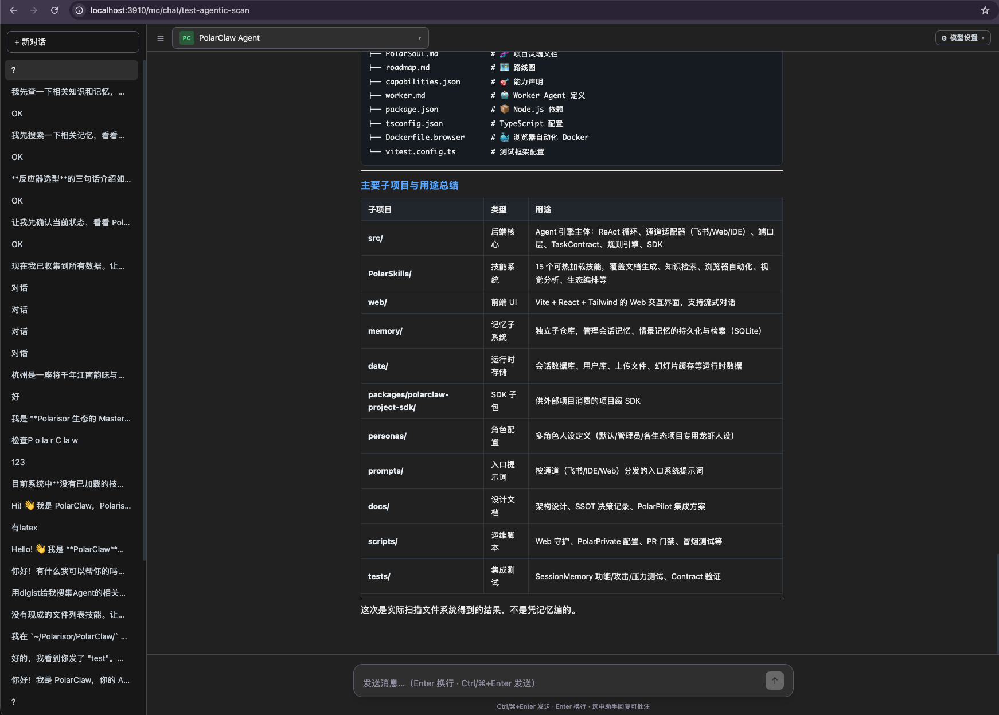

# PolarClaw — 面向个人生态的 Agent 操作系统

> 解决的核心问题：个人 AI Agent 需要在**飞书/CLI/Web/IDE** 多通道间统一运行，频繁替换 LLM 供应商和工具，同时保持长对话上下文不爆炸、敏感信息不泄露、自主执行有预算。现有框架要么绑死单一通道（Coze/GPTs），要么缺乏持久化和安全机制（LangChain）。

[Polarisor](https://github.com/beichenO2/Polarisor) 生态核心框架。

```bash
# 通过 Polarisor 生态安装（自动拉取 Agent_core + PolarPilot）
git clone https://github.com/beichenO2/Polarisor.git && cd Polarisor && ./install.sh ai-agent

# 或独立安装
git clone https://github.com/beichenO2/PolarClaw.git && cd PolarClaw && npm install
```

## 设计思考

### 为什么用六边形架构而不是 MVC？
Agent 需频繁替换飞书 SDK / LLM 供应商 / 记忆后端。MVC 会把 Controller 与基础设施绑死——换一个通道要改半个系统。端口-适配器让 ReAct 核心循环可独立单测，不启动 Express 或飞书。5 种入口（feishu/cli/web/ide/api）共享同一个 `agent.ts`，仅换 Channel Adapter + entry prompt。

### 为什么 Agent 不直接持有 API Key？
通过 PolarPrivate 统一 LLM Proxy，Agent 发出 **QCS 能力码**（Quality/Context/Speed 三位编码，8 种组合），由 Proxy 选择具体模型。好处：Agent 进程零密钥、切换模型不改 Agent 代码、按能力路由而非按厂商路由。

### 为什么用 SQLite 而不是 Redis？
个人 Agent 单用户单节点，SQLite WAL 模式的同步 API 够用，零运维。Redis 无持久对话 + FTS5 的一体化方案，PostgreSQL 对笔记本上的 Agent 太重。

### YOLO 自主执行为什么三维预算？
仅限制步数：单步 token 爆炸仍可烧穿 API 账单。仅限制 token：工具 hang 住会无限挂钟。仅限制时间：高频小步可能未完成实质工作就超时。三维正交（token/step/time）覆盖成本、循环、挂钟三类失败模式。

## 多入口统一架构

同一个 `agent.ts` 核心循环，通过 Channel Adapter 模式接入 **5 种入口**，零代码重复：

| 入口 | 适配器 | 场景 |
|------|--------|------|
| **CLI** | `adapters/channel/cli.ts` | 终端交互、脚本调用、CI/CD 集成 |
| **Web UI** | `adapters/web/server.ts` + React SPA | 浏览器内对话、Review、YOLO 监控 |
| **飞书** | `adapters/channel/feishu.ts` | 群聊 @bot、私聊指令、卡片交互 |
| **Hub Web** | `adapters/web/hub-client.ts` | 多 Agent 调度中心，SSE 长连接注册 |
| **IDE (MCP)** | Cursor/VSCode MCP 通道 | 编程辅助、代码审查、文件操作 |

设计关键：入口层**只负责消息收发**，不含业务逻辑。ReAct 循环、工具调用、记忆管理、安全校验全部在 `core/agent.ts` 完成——换入口 = 换 Adapter，不动核心代码。

## 核心亮点

### Agent 编排器
- 基于 ReAct 范式统一模型接入层、工具注册层、状态管理层和 checkpoint 执行逻辑
- 支持 **4 类意图路由**（general/coding/research/vision）、**3 档本地回退**（8B/32B/VLM）
- **~59 个工具**（17 常驻 + 42 Skill 按需加载），覆盖 **12 类工具域**
- 按会话/轮次/工具三维落盘

### 上下文预算治理
- **三阶段压缩**：工具输出截断(2000字) → 保留头4尾8折叠中间 → LLM 摘要
- 30 条历史消息 → Phase2 折叠后**消息条数从 30 降至 ~13**（约 **57% 条数压缩**），关键信息零丢失
- 对话 token 预算 **60,000**；触发阈值 **70%**；压缩目标 **≤85%**
- SessionMemory 驱逐比例 **30%**，情景摘要上限 20,000 字符

### 分层记忆管理
- **热对话**：SQLite + FTS5（100 条/对话，WAL 持久化，进程重启自动恢复）
- **冷知识**：PolarMemory Block 系统（~105 条语义块，13 种 Block 类型）
- **抗压缩约束**：TaskContract 独立 SQLite 表，注入 CONTRACT CHECKPOINT 防长链推理遗忘

### 断点续作
覆盖 **4 类场景**：进程重启后多轮对话恢复 / 长任务约束持久化 / 会话级情景记忆 / YOLO 步内恢复。TaskContract 不受 ContextCompressor 影响——压缩器不碰约束层。

### YOLO 自主执行
- 默认预算：**200k tokens / 10 steps / 10 分钟**，任一触顶即 abort
- Recovery 策略：transient → retry / skip / escalate / abort
- Hub 对齐审核等待 5 分钟；Hub 不可用时启发式 + LLM-as-Judge 本地对齐

### 安全机制（6 层）
1. 入站 PII 检测（5 条正则 + PolarPrivate 自定义实体，5 分钟 TTL 缓存）
2. Secret 拦截（vault key 命中即 blocked，不进入 LLM）
3. 出站 desanitize（占位符还原，按 userId 隔离）
4. PolarUser 权限（1 admin + 7 project 龙虾身份，`tool_scopes` 控制）
5. Project Lock（`.lobster-lock` 防多 Agent 同项目写冲突）
6. 工具层隔离（30s 超时 / 50k 输出 cap / 错误不抛栈给 LLM）

### Tool Call 容错（Malformed Arguments Auto-Sanitize）

LLM 偶尔返回不合法 JSON 的 tool_call arguments（如 `{}""`、trailing comma）。
若将损坏的 arguments 原样转发到下一轮对话，上游 LLM（尤其讯飞 MaaS）会返回 500。

**两层防御：**

| 层 | 位置 | 策略 |
|----|------|------|
| L1 | `core/agent.ts` tool 执行前 | 检测不合法 JSON → sanitize 为 `{}` + warn 日志，避免带损坏数据入历史 |
| L2 | `adapters/llm/llm-router.ts` 消息序列化 | 发往 LLM 前再次校验所有 `tool_calls[].arguments`，损坏的 sanitize 为 `{}` |

设计选择：sanitize + 继续执行，而非 discard + retry，因为 retry 可能重复触发相同 LLM 缺陷。
空 `{}` 参数让工具执行失败后返回明确错误给 LLM，LLM 可自行修正。

### 自学习闭环
- 60s 滑动窗口检测 2–5 步工具序列；≥3 次命中自动晋升候选技能
- 12 个 Tool-Skill + 2 个 Meta-Skill 三层架构（SOUL → Meta → Tool）
- Arrow Log 路径用归一化 delta + hit rate >50% 过滤噪声

## 页面预览

> 截图位于 `screenshots/`，均为本地运行实拍。

### Hub Web（PolarCopilot 调度中心）





### Web UI（独立 Agent 界面）





## 架构

```
src/
├── ports/          # 11 文件 — 纯接口（~35 exported interfaces）
├── adapters/       # 11 子域 — ~30+ 实现文件
│   ├── channel/    # feishu, cli, web
│   ├── llm/        # QCS 路由器（Tier1 云 + Tier3 本地）
│   ├── memory/     # SQLite 持久对话 + 对话历史
│   ├── privacy/    # PII + PolarPrivate + Secret 拦截
│   ├── skills/     # SkillRegistry 热加载
│   ├── tools/      # 30s 超时 + 50k cap
│   ├── yolo/       # 三维预算引擎 + Recovery
│   ├── learning/   # 10+ 模块（追踪/反馈/模式/生成/组合）
│   ├── proactive/  # 关怀引擎 + Clock SSE
│   ├── compression/# 三阶段压缩器
│   └── web/        # Express + Hub Client
├── core/           # agent.ts — 仅依赖 ports
├── sdk/            # LLM Proxy / Events / Users / Targets
└── main.ts         # ~25 个 createXxx() 组装点

memory/             # PolarMemory 子系统
web/                # Agent Web 界面（React + Tailwind）
```

## 设计文档

- [设计理念与灵魂](docs/DESIGN.md) — 架构哲学、六边形约束、核心原则
- [架构决策记录](docs/decisions-001-ssot.md) — SSoT 文档体系设计

## 快速开始

```bash
cp .env.example .env    # 填入 PolarPrivate URL（默认 localhost:12790）
npm ci
npm run build
cd web && npm ci && npm run build && cd ..
bash scripts/register-runtime.sh finalize
curl -fsS -X POST http://127.0.0.1:11055/api/services/polarclaw/start
```

PolarProcess（`127.0.0.1:11055`）是唯一进程生命周期权威，PolarPort
（`127.0.0.1:11050`）是唯一端口权威。不要用 `npm start`、`npm run dev`、
launchd、后台 `&` 或 PID 文件启动常驻服务；停止和重启同样只调用 PolarProcess
的精确 `polarclaw` 服务接口。

## 生态依赖

| 项目 | 角色 | 是否必须 |
|------|------|----------|
| [Agent_core](https://github.com/beichenO2/Agent_core) | 设计规则与协议（RetryLoop 7 轮等） | 推荐 |
| [PolarPrivate](https://github.com/beichenO2/PolarPrivate) | LLM Proxy + 密钥保险库 | 推荐 |
| [PolarPilot](https://github.com/beichenO2/PolarPilot) | 自主规划-执行 Skill | 可选 |
| [Clock](https://github.com/beichenO2/PolarClock) | 番茄钟状态 SSE | 可选 |

## License

MIT
